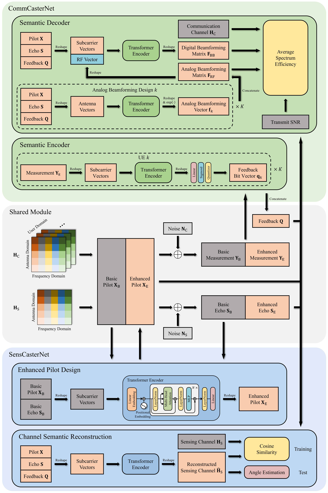

## Introduction

This repository contains the source code for the following paper [1].

[1] Y. Zhang et al., "AI Empowered Channel Semantic Acquisition for 6G Integrated Sensing and Communication Networks," in IEEE Network, doi: 10.1109/MNET.2024.3354264.

Considering the correlation between C&S channels, we propose a two-stage frame structure along with the channel semantic learning based JCASCasterNet, which yield gains in both extraction and reconstruction of channel semantic.

    

For more information, please visit our website gaozhen16.github.io

If you have any questions, you can contact me by email: yifeizhang2000@foxmail.com

## Training

Run the main function in `main.py` to start training. The core code of JCASCasterNet is in `train/model.py`.

## License

All code within this repository is under [Apache License 2.0](https://www.apache.org/licenses/LICENSE-2.0).